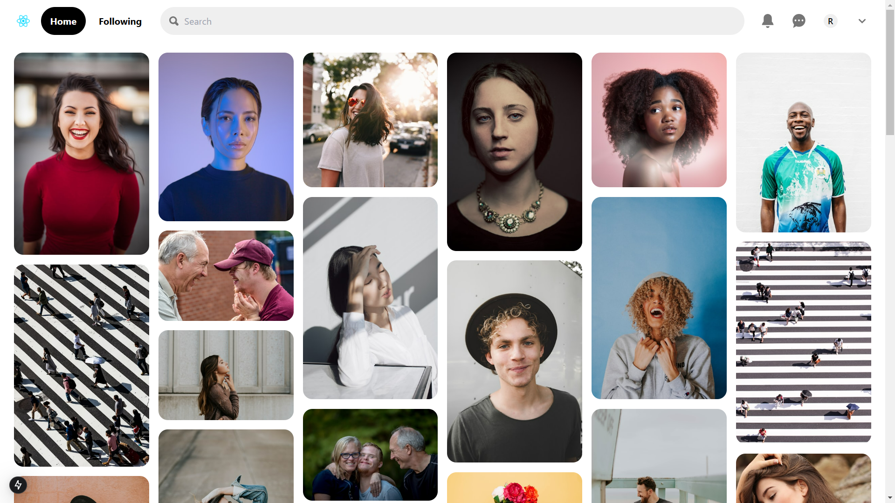

# Pinterest Clone

A Pinterest-like web application built with **Next.js** and **React**, featuring a responsive masonry grid layout, user profiles, and integration with the **Unsplash API** for fetching high-quality images.

## Reference

This project is based on [rmznkapar/pinterest-web-clone](https://github.com/rmznkapar/pinterest-web-clone).

---
